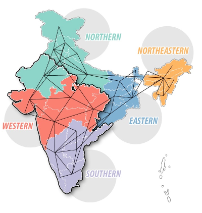

name: toc

# Table of contents

1. [Background](#background)

2. [Gridpath](#gridpath)

4. [Ongoing/future work](#future)

---
class: inverse, center, middle
name: background

# Background

<hr/>

---

# <font size="6pt">India is the world’s third-largest energy consumer, after the US and China</font>

--
India's current electricity mix is made up of mostly coal-sourced generation
.center[
```{r echo = FALSE, out.width = '70%'}
knitr::include_graphics("img/figure8_2020.png")
```
]

---

# Electricity demand in India is projected to grow 4.7% per year

.center[
```{r echo = FALSE, out.width = '80%'}
knitr::include_graphics("img/world-electricity-generation.png")
```
]

---

# Large-scale renewable energy is expected to increase as well

--

The government of India has established renewable energy goals for the grid
.center[
```{r echo = FALSE, out.width = '55%'}
knitr::include_graphics("img/india-re-goals-2.png")
```
]

--

Renewables is projected to make up the majority of the electricity mix by 2050
.center[
```{r echo = FALSE, out.width = '28%'}
knitr::include_graphics("img/india-projected-re.png")
```
]

---
class: inverse, center, middle
name: gridpath

# Gridpath

<hr/>

---

# <font size="6px"> Gridpath is a capacity expansion and production cost modeling platform </font>

--

.pull-left[
.center[
```{r echo = FALSE, out.width = '60%'}
knitr::include_graphics("img/capacity-expansion.png")
```
]

.center[**Capacity expansion**]
* Examine how the generation mix should evolve over the long-term
* Decide whether to build or retire generation, storage, transmission

]

--

.pull-right[
.center[
```{r echo = FALSE, out.width = '60%'}
knitr::include_graphics("img/production-cost.png")
```
]

.center[**Production cost**]
* Simulate detailed operations of a power system over a short period
* Estimate operating costs of the system and assess impacts of investments or strategies on system operation
<!-- * Unit commitment and economic dispatch model solved over 1 day or 1 year at 5, 15 min or hourly temporal resolution. -->
]

---

# Gridpath is open-source!

Developed by Blue Marble Analytics

.center[
```{r echo = FALSE, out.width = '60%'}
knitr::include_graphics("img/blue-marble.png")
```
]

You can download Gridpath on Github: [github.com/blue-marble/gridpath](https://github.com/blue-marble/gridpath)

---
class: inverse, center, middle
name: future

# Using Gridpath to model optimal investments with RE targets in India

<hr/>

---

# Research questions

1. How do renewable energy scenarios India look like given different technology costs, transmission constraints, and renewable portfolio standards (RPS)?

2. Will the environmental benefits of high renewable penetration be distributed equitably across India? 

3. How will the water usage for power plant operations change, and how will water constraints affect power plant operations?

---

# Research questions

1. **How do renewable energy scenarios India look like given different technology costs, transmission constraints, and renewable portfolio standards (RPS)?**

2. <font color="#ced8d8">Will the environmental benefits of high renewable penetration be distributed equitably across India?</font>

3. <span style="color:#ced8d8";>How will the water usage for power plant operations change, and how will water constraints affect power plant operations?</span>

---

# <font size="6.5pt">There is a spatial diversity in wind and solar resources across India</font>
--

.right-column[
.center[
```{r echo = FALSE, out.width = '45%'}
knitr::include_graphics("img/india-solar-resource.jpeg")
```
]
]


---

# Addressing research question 1

--
.left-column[
How do renewable energy scenarios India look like given different technology costs, transmission constraints, and renewable portfolio standards (RPS)?
]

--
.right-column[
.center[
```{r echo = FALSE, out.width = '30%'}

```
]
For next steps, we will be adding the following to the India model:
* Multiple cost trajectories for wind, solar, and battery storage
* Transmission constraints
* Renewable portfolio obligations
]

---

# Research questions

1. **How do renewable energy scenarios India look like given different technology costs, transmission constraints, and renewable portfolio standards (RPS)?**

2. <font color="#ced8d8">Will the environmental benefits of high renewable penetration be distributed equitably across India?</font>

3. <span style="color:#ced8d8";>How will the water usage for power plant operations change, and how will water constraints affect power plant operations?</span>

---

# Research questions

1. <span style="color:#ced8d8";> How do renewable energy scenarios India look like given different technology costs, transmission constraints, and renewable portfolio standards (RPS)?</span>

2. **Will the environmental benefits of high renewable penetration be distributed equitably across India?**

3. <font color="#ced8d8">How will the water usage for power plant operations change, and how will water constraints affect power plant operations?</font>

---

# Addressing research question 2

--
.left-column[
Will the environmental benefits of high renewable penetration be distributed equitably across India? 
]

--
.right-column[
.center[
```{r echo = FALSE, out.width = '40%'}
knitr::include_graphics("img/india-coal.jpg")
```
]
For next steps, we will be adding the following to the India model:
* Add environmental pollutant emission factors into model
]

---

# Research questions

1. <span style="color:#ced8d8";> How do renewable energy scenarios India look like given different technology costs, transmission constraints, and renewable portfolio standards (RPS)?</span>

2. **Will the environmental benefits of high renewable penetration be distributed equitably across India?**

3. <font color="#ced8d8">How will the water usage for power plant operations change, and how will water constraints affect power plant operations?</font>

---

# Research questions

1. <span style="color:#ced8d8";> How do renewable energy scenarios India look like given different technology costs, transmission constraints, and renewable portfolio standards (RPS)?</span>

2. <font color="#ced8d8">Will the environmental benefits of high renewable penetration be distributed equitably across India?</font>

3. **How will the water usage for power plant operations change, and how will water constraints affect power plant operations?**

---

# Addressing research question 3

--
.left-column[
How will the water usage for power plant operations change, and how will water constraints affect power plant operations?
]

--
.right-column[
.center[
```{r echo = FALSE, out.width = '40%'}
knitr::include_graphics("img/parched_power_map.png")
```
]
* Add water intensity factors into model
* Incorportate climate and water/hydrology model outputs as constraints
]

---
class: inverse, center, middle

# Thank you!
<!-- <html><div style='float:left'></div><hr color='#EB811B' size=1px width=796px></html> -->
