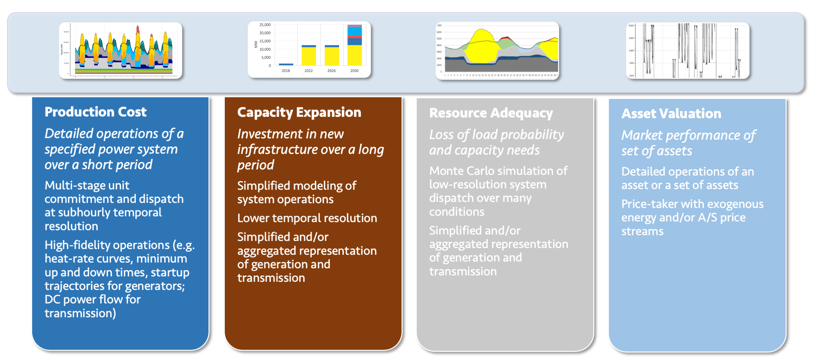

name: toc

# Table of contents

1. [Background](#background)

2. [Previous work](#review)

3. [Research questions](#rq)

4. [Gridpath](#gridpath)

5. [Ongoing/future work](#future)

---
class: inverse, center, middle
name: background

# Background

<hr/>

---

# Some info on India's electricity grid

---

class: inverse, center, middle
name: review

# Previous work

<hr/>

---

# Review work that's already been done

---
class: inverse, center, middle
name: rq

# Research questions

<hr/>

---

# We are interested in the following research questions:

1. How do renewable energy scenarios India look like given different technology costs, transmission constraints, and renewable portfolio standards (RPS)?

2. Will the environmental benefits of high renewable penetration be distributed equitably across India? 

3. How will the water usage for power plant operations change, and how will water constraints affect power plant operations?

---

# We are interested in the following research questions:

1. **How do renewable energy scenarios India look like given different technology costs, transmission constraints, and renewable portfolio standards (RPS)?**

2. <font color="#ced8d8">Will the environmental benefits of high renewable penetration be distributed equitably across India?</font>

3. <span style="color:#ced8d8";>How will the water usage for power plant operations change, and how will water constraints affect power plant operations?</span>

---

# slide on rq 1

---

# We are interested in the following research questions:

1. **How do renewable energy scenarios India look like given different technology costs, transmission constraints, and renewable portfolio standards (RPS)?**

2. <font color="#ced8d8">Will the environmental benefits of high renewable penetration be distributed equitably across India?</font>

3. <span style="color:#ced8d8";>How will the water usage for power plant operations change, and how will water constraints affect power plant operations?</span>

---

# We are interested in the following research questions:

1. <span style="color:#ced8d8";> How do renewable energy scenarios India look like given different technology costs, transmission constraints, and renewable portfolio standards (RPS)?</span>

2. **Will the environmental benefits of high renewable penetration be distributed equitably across India?**

3. <font color="#ced8d8">How will the water usage for power plant operations change, and how will water constraints affect power plant operations?</font>

---

# slide on rq 2

---

# We are interested in the following research questions:

1. <span style="color:#ced8d8";> How do renewable energy scenarios India look like given different technology costs, transmission constraints, and renewable portfolio standards (RPS)?</span>

2. **Will the environmental benefits of high renewable penetration be distributed equitably across India?**

3. <font color="#ced8d8">How will the water usage for power plant operations change, and how will water constraints affect power plant operations?</font>

---

# We are interested in the following research questions:

1. <span style="color:#ced8d8";> How do renewable energy scenarios India look like given different technology costs, transmission constraints, and renewable portfolio standards (RPS)?</span>

2. <font color="#ced8d8">Will the environmental benefits of high renewable penetration be distributed equitably across India?</font>

3. **How will the water usage for power plant operations change, and how will water constraints affect power plant operations?**

---

# slide on rq 3

---
class: inverse, center, middle
name: gridpath

# Gridpath

<hr/>

---

# Provide an overview of gridpath

Gridpath is an **open-source** capacity expansion and production cost model developed by Blue Marble Analytics

.center[
```{r echo = FALSE, out.width = '90%'}

```
]

---

# What is capacity expansion or production cost?

--

**Capacity expansion**

--

* Identify generation, storage, DR, and transmission investments and retirements

--

* Simultaneously minimize capacity and operations costs across several years

--

**Production cost**

--

* Estimate operating costs of the system and assess impacts of investments or strategies on system operation

--

* Unit commitment and economic dispatch model solved over 1 day or 1 year at 5, 15 min or hourly temporal resolution.

---
class: inverse, center, middle
name: future

# Ongoing/future work

<hr/>

---

# Research question 1

### How do renewable energy scenarios India look like given different technology costs, transmission constraints, and renewable portfolio standards (RPS)?

The India model has been expanded to include multiple load zones (one for each state/province).

--

The next additions to the model are:
--

- Technology (solar, wind, battery) costs
--

- Transmission constraints
--

- RPS scenarios

---

# Research question 2

### Will the environmental benefits of high renewable penetration be distributed equitably across India? 

Introduce how coal plants are clustered around north/central India (coal-mining states that operate low-cost plants). Coal plants in southern regions are more expensive to operate, so they are the most likely to shut down

Include map of India's coal plants

--

The next additions to the model are:

--

- Add environmental pollutant emission factors into model

---

# Research question 3

### How will the water usage for power plant operations change, and how will water constraints affect power plant operations?

Show articles mentioning coal curtailments/shut downs due to drought

--

The next additions to the model are:

--

- Add water intensity factors into model

--

- Incorportate climate and water/hydrology model outputs as constraints


---
class: inverse, center, middle

# Thank you!
<!-- <html><div style='float:left'></div><hr color='#EB811B' size=1px width=796px></html> -->
