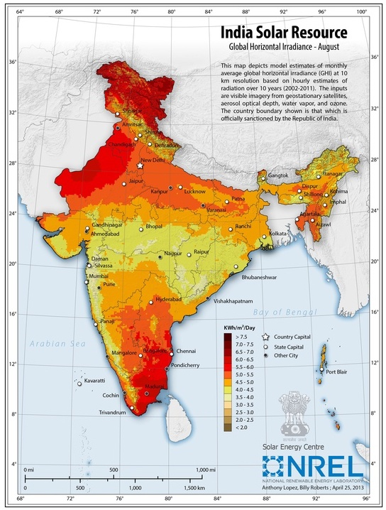
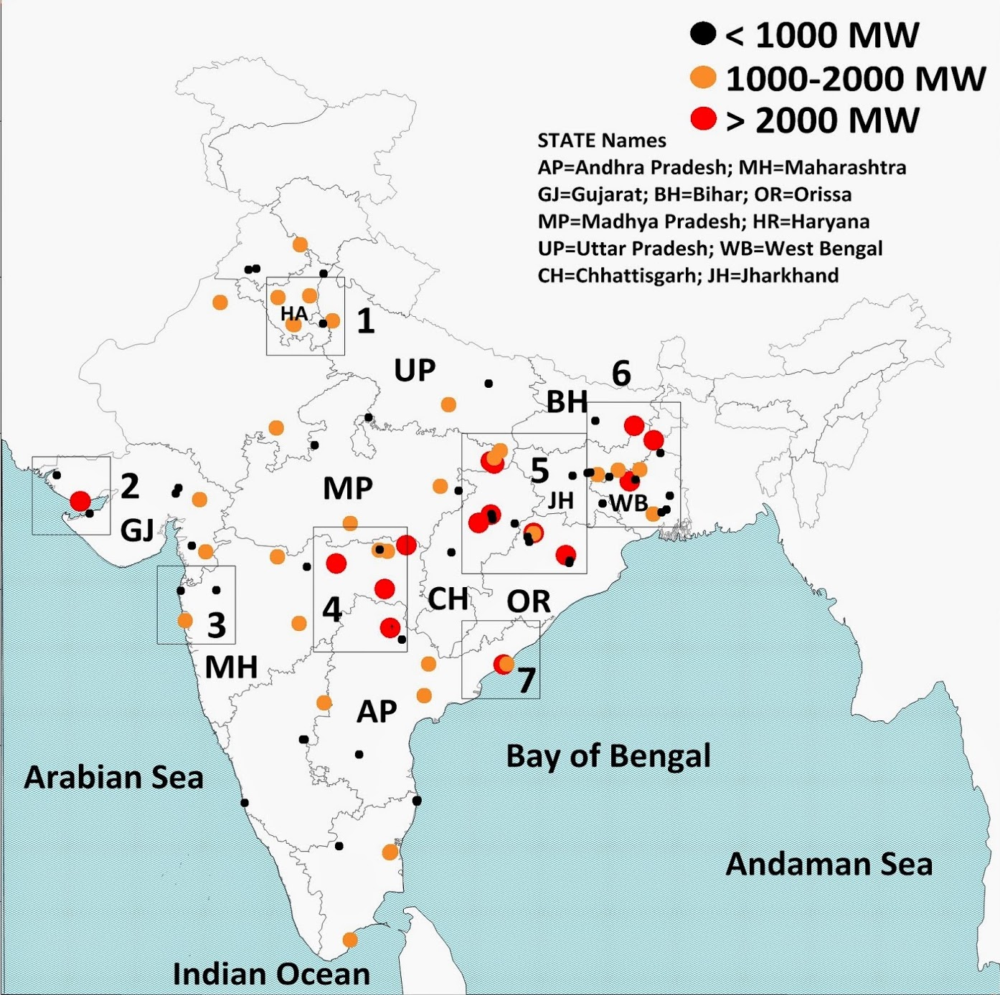

class: inverse, center, middle
name: background

# Background

<hr/>

---

# <font size="6pt">India is the world’s third-largest energy consumer, after the US and China</font>

--

* Most of India's electricity currently comes from coal power plants
```{r echo = FALSE, out.width = '50%', out.extra='style="float:right; padding:1px"'}

```

--

* Electricity demand in India is projected to grow 4.7% per year

```{r echo = FALSE, out.width = '50%'}

```

---

# Large-scale renewable energy is expected to increase as well

--

* The government of India has established renewable energy goals for the power sector
```{r echo = FALSE, out.width = '58%', out.extra='style="float:right; padding:5px"'}

```

--

* Renewables are projected to make up most of the electricity mix by 2050
```{r echo = FALSE, out.width = '40%'}
knitr::include_graphics("img/india-projected-re.png")
```

---
class: inverse, center, middle
name: gridpath

# Gridpath

<hr/>

---

# <font size="6pt"> Gridpath is a capacity expansion and production cost modeling platform </font>

--

.pull-left[
.center[
```{r echo = FALSE, out.width = '60%'}
knitr::include_graphics("img/capacity-expansion.png")
```
]

.center[**Capacity expansion**]
* Examine how the generation mix should evolve over the long-term
* Decide whether to build or retire generation, storage, transmission

]

--

.pull-right[
.center[
```{r echo = FALSE, out.width = '60%'}

```
]

.center[**Production cost**]
* Simulate detailed operations of a power system over a short period
* Estimate operating costs of the system and assess impacts of investments or strategies on system operation
<!-- * Unit commitment and economic dispatch model solved over 1 day or 1 year at 5, 15 min or hourly temporal resolution. -->
]

---

# Gridpath is open-source!

Developed by Blue Marble Analytics

.center[
```{r echo = FALSE, out.width = '60%'}
knitr::include_graphics("img/blue-marble.png")
```
]

You can download Gridpath on Github: [github.com/blue-marble/gridpath](https://github.com/blue-marble/gridpath)

---
class: inverse, center, middle
name: future

# Using Gridpath to model India's electricity futures

<hr/>

---

# Research questions

1. What are the impacts of technology costs, renewable portfolio standards, and transmission constraints on renewable energy investments?

2. Will the environmental benefits of high renewable penetration be distributed equitably across India? 

3. How will the water usage for power plant operations change, and how will water constraints affect power plant operations?

---

# Research questions

1. **What are the impacts of technology costs, renewable portfolio standards, and transmission constraints on renewable energy investments?**

2. <font color="#ced8d8">Will the environmental benefits of high renewable penetration be distributed equitably across India?</font>

3. <span style="color:#ced8d8";>How will the water usage for power plant operations change, and how will water constraints affect power plant operations?</span>

---

# <font size="6.5pt">There is spatial diversity in wind and solar resources across India</font>
--

.pull-left[
More than 50% of India’s installed solar capacity is concentrated in southern region
.center[
```{r echo = FALSE, out.width = '40%'}

```
]
]

--
.pull-right[
Wind resources are highest in western and southern regions
.center[
```{r echo = FALSE, out.width = '55%'}

```
]
]

--

Transmission capacity will be needed to integrate renewable energy capacity, but limits on transmission buildout could affect which renewable technologies are deployed

---

# Research questions

1. **What are the impacts of technology costs, renewable portfolio standards, and transmission constraints on renewable energy investments?**

--

  Next steps:
  * Add multiple cost trajectories for wind, solar, and battery storage
  * Build scenarios for renewable portfolio obligation targets of 10%, 30%, 50%, and 70 RE
  * Add transmission constraints

---

# Research questions

1. **What are the impacts of technology costs, renewable portfolio standards, and transmission constraints on renewable energy investments?**

2. <font color="#ced8d8">Will the environmental benefits of high renewable penetration be distributed equitably across India?</font>

3. <span style="color:#ced8d8";>How will the water usage for power plant operations change, and how will water constraints affect power plant operations?</span>

---

# Research questions

1. <span style="color:#ced8d8";> What are the impacts of technology costs, renewable portfolio standards, and transmission constraints on renewable energy investments?</span>

2. **Will the environmental benefits of high renewable penetration be distributed equitably across India?**

3. <font color="#ced8d8">How will the water usage for power plant operations change, and how will water constraints affect power plant operations?</font>

---

# Cheap coal power plants are co-located with poverty

--
* Coal power plants are concentrated in west-central northern regions of India
<div style= "position: relative; left: 50px; float: left;">
```{r echo = FALSE, out.width = '52%'}

```
</div>

<div style= "position: relative;">
```{r coal, echo = FALSE, out.width = '27%'}

```
</div>
--

* Largest coal reserves are located in eastern and southern regions, so coal plants there are cheaper to operate
--

* Eastern and southern states also have the highest poverty rates
--

* As solar and wind get cheaper, the more expensive coal plants in higher income regions will likely shut down first

---

# Research questions

1. <span style="color:#ced8d8";> What are the impacts of technology costs, renewable portfolio standards, and transmission constraints on renewable energy investments?</span>

2. **Will the environmental benefits of high renewable penetration be distributed equitably across India?**
  
--

  Next steps:
    * Assign pollutant emission factors (for NOx, SOx, PM2.5, etc) to power plants

---

# Research questions

1. <span style="color:#ced8d8";> What are the impacts of technology costs, renewable portfolio standards, and transmission constraints on renewable energy investments?</span>

2. <font color="#ced8d8">Will the environmental benefits of high renewable penetration be distributed equitably across India?</font>

3. **How will the water usage for power plant operations change, and how will water constraints affect power plant operations?**

---

# India's power sector is very dependent on water

--

* 80% of India’s electricity is generated from thermal (fossil fuel, biomass, nuclear, and concentrated solar) power plants, which require water for cooling
--

  * Thermal power plants are located in water-stressed areas
    ```{r parched, echo = FALSE, out.width = '48%', out.extra='style="float:right; padding:5px"'}
    knitr::include_graphics("img/parched_power_map.png")
    ```

--

* Power plants have had to shut down in recent years due to water shortages

```{r echo = FALSE, out.width = '45%'}

```

```{r echo = FALSE, out.width = '45%'}

```

--

* Hydropower plants, which also requires water, make up 10% of electricity generation

---

# Research questions

1. <span style="color:#ced8d8";> What are the impacts of technology costs, renewable portfolio standards, and transmission constraints on renewable energy investments?</span>

2. <font color="#ced8d8">Will the environmental benefits of high renewable penetration be distributed equitably across India?</font>

3. **How will the water usage for power plant operations change, and how will water constraints affect power plant operations?**

---

# Research questions

1. <span style="color:#ced8d8";> What are the impacts of technology costs, renewable portfolio standards, and transmission constraints on renewable energy investments?</span>

2. <font color="#ced8d8">Will the environmental benefits of high renewable penetration be distributed equitably across India?</font>

3. **How will the water usage for power plant operations change, and how will water constraints affect power plant operations?**

--

  Next steps: 
  * Add water intensity factors into model
  * Incorportate climate and water/hydrology model outputs as constraints
  
---

# Research questions

1. **What are the impacts of technology costs, renewable portfolio standards, and transmission constraints on renewable energy investments?**

2. **Will the environmental benefits of high renewable penetration be distributed equitably across India?**

3. **How will the water usage for power plant operations change, and how will water constraints affect power plant operations?**


---
class: inverse, center, middle

# Thank you!
